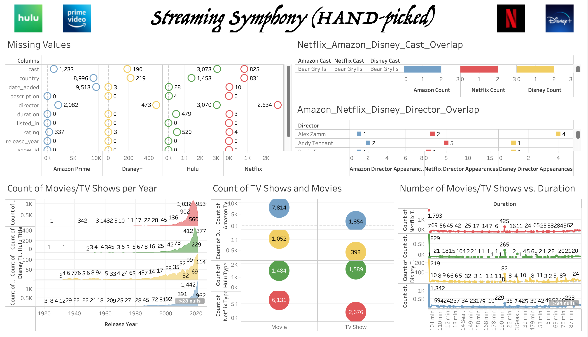

# Group 46 - Streaming Symphony (HAND-picked)

## Topic/Interest Description

This dataset explores trending streaming services such as Hulu, Amazon Prime, Netflix, and Disney+. Our goal is to conduct a comprehensive analysis by visualizing the four datasets to answer questions about trends in TV shows, movies, directors, cast, countries, genres, ratings, etc., like the ones listed below:

- Which TV shows and movies are available on all the four streaming platforms? Which of them are unique to only one platform?
- What is the ratio of movies to TV shows within the four platforms?
- Which directors have directed movies and TV shows that are available on all the four streaming platforms? Which directors appear only on one of the streaming platforms?
- How many of the TV shows and movies are available in each country? How many of them are available across multiple countries and how many are only available in one?
- In which month were the most TV shows added to each platform? What about movies?
- ...

Drawing such connections can lead us to generate information that can be used to create a user-facing dashboard for viewers, producers, and other stakeholders in the streaming industry. It can help them make informed decisions about content to watch, create and distribute.

## Data Set Description

The "Streaming Symphony" created from these datasets (Hulu, Amazon Prime, Netflix, and Disney+) provides insights into movie and TV content on streaming platforms. The datasets include:

#### The data sets includes:
- show ID
- type
- title
- director
- cast
- country
- date added
- release year
- rating
- duration
- genre
- description

Although the dataset's collection method is unclear, it was gathered in mid-2021 and provided by Shivam Bansal on Kaggle, a community platform for data scientists and machine learning enthusiasts.

The dataset provides a snapshot of available content on each platform up to mid-2021, which is why the datasets may not be 100% comprehensive or accurate with current trends. Nevertheless, the datasets allow for analysis of trends over time in genres across platforms and countries, useful for researchers studying the streaming industry. Information about directors and cast members can be valuable for analyzing industry patterns. Combining the datasets offers a comprehensive overview of streaming platform offerings for comparison.

## Team Members

- Anitej Isaac Sharma (Second-Year Computer Science)
- Ethan Hsu (Third-Year computer Science)
- Alex Henczel (Third-Year Physics)

## Images

## References

- [Hulu Movies and TV Shows](https://www.kaggle.com/datasets/shivamb/hulu-movies-and-tv-shows)
- [Amazon Prime Movies and TV Shows](https://www.kaggle.com/datasets/shivamb/amazon-prime-movies-and-tv-shows)
- [Netflix Movies and TV Shows](https://www.kaggle.com/datasets/shivamb/netflix-shows)
- [Disney+ Movies and TV Shows](https://www.kaggle.com/datasets/shivamb/disney-movies-and-tv-shows)