# Group 46 - Streaming Symphony (HAND-picked)

## Topic/Interest Description

This dataset explores trending streaming services such as Hulu, Amazon Prime, Netflix, and Disney+. Our goal is to conduct a comprehensive analysis by visualizing the four datasets to answer questions about trends in TV shows, movies, directors, cast, countries, genres, ratings, etc., like the ones listed below:

- Which TV shows and movies are available on all the four streaming platforms? Which of them are unique to only one platform?
- What is the ratio of movies to TV shows within the four platforms?
- Which directors have directed movies and TV shows that are available on all the four streaming platforms? Which directors appear only on one of the streaming platforms?
- How many of the TV shows and movies are available in each country? How many of them are available across multiple countries and how many are only available in one?
- In which month were the most TV shows added to each platform? What about movies?
- ...

Drawing such connections can lead us to generate information that can be used to create a user-facing dashboard for viewers, producers, and other stakeholders in the streaming industry. It can help them make informed decisions about content to watch, create and distribute.

## Data Set Description

The "Streaming Symphony" created from these datasets (Hulu, Amazon Prime, Netflix, and Disney+) provides insights into movie and TV content on streaming platforms. The datasets include:

#### The data sets includes

- show ID
- type
- title
- director
- cast
- country
- date added
- release year
- rating
- duration
- genre
- description

Although the dataset's collection method is unclear, it was gathered in mid-2021 and provided by Shivam Bansal on Kaggle, a community platform for data scientists and machine learning enthusiasts.

The dataset provides a snapshot of available content on each platform up to mid-2021, which is why the datasets may not be 100% comprehensive or accurate with current trends. Nevertheless, the datasets allow for analysis of trends over time in genres across platforms and countries, useful for researchers studying the streaming industry. Information about directors and cast members can be valuable for analyzing industry patterns. Combining the datasets offers a comprehensive overview of streaming platform offerings for comparison.

## Explory Data Analysis

As we can see from graph below, the shows and movies released on Netflix are mostly concentrated between 2010 and 2020. The number of shows and movies released on Netflix is increasing over the years since the mean and quarters are closer to the top of the chart.

    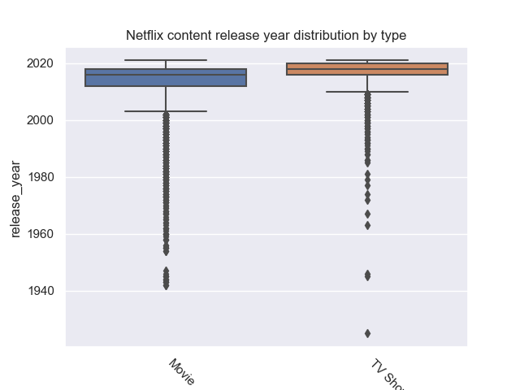
    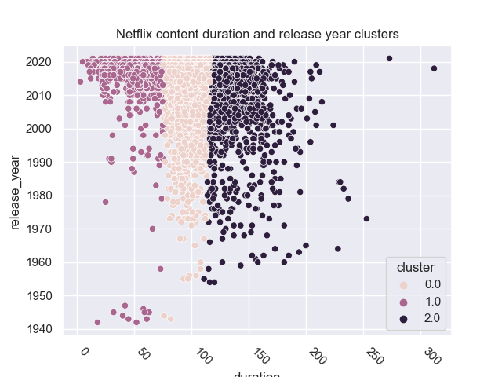

From the bar chart below, we can see that the most shows on all platforms are rated for general audiences. The bars on the left side (indicating for less mature audiences) are much longer than the bars on the right side (indicating for more mature audiences).

    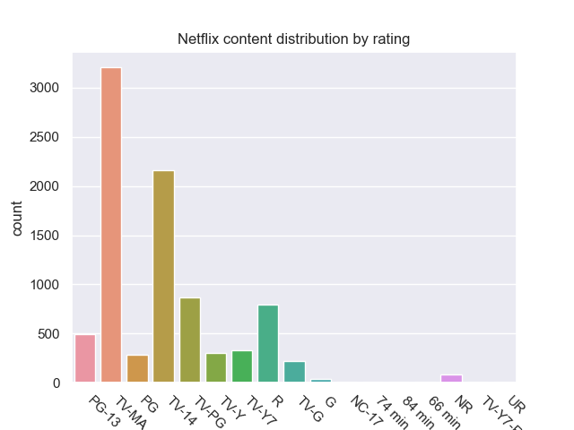
    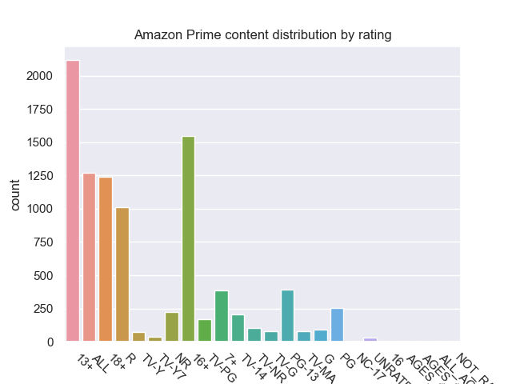
    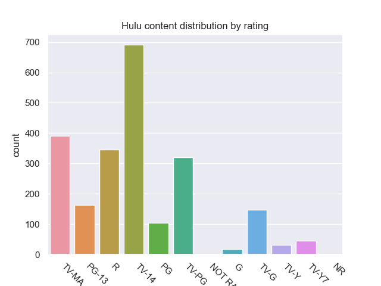
    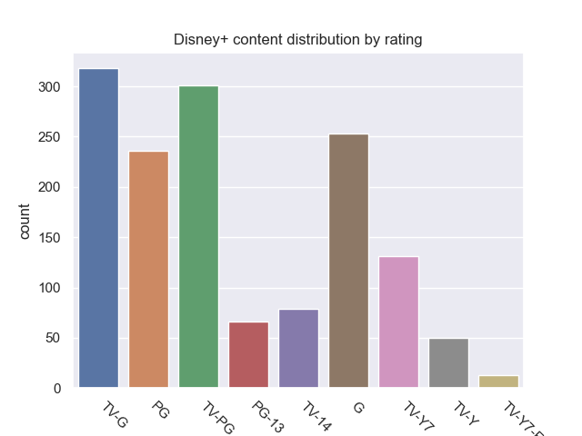

## Research Questions

I am interested in what genre each platform uploads the most, like what each genre is the most dominant on each platform and within each platform what's the distribution like.
Also I am interested in what genre each director have participated in and which genre each director participated the most. The other point I want to dig into is what genre the actor participated the most.

### **Question 1 (Ethan):**

#### *What genre each director have participated in and which genre each director participated the most & what genre the actor participated the most*

Regarding the directors and actors who have participated in various genres, it appears that each director and actor has their preferred genre. This preference could be why they are more likely to show up in shows of specific genres. It is also interesting to note that there are few directors or actors who have participated in more than 20 shows, except on Amazon Prime. For instance, Mark Knight directed 109 shows in the "special interest" genre, which is the highest number for any director in a single genre across all platforms. Similarly, Gene Autry participated in 31 shows in the "western" genre, which is the highest number for any actor in a single genre across all platforms.

    
    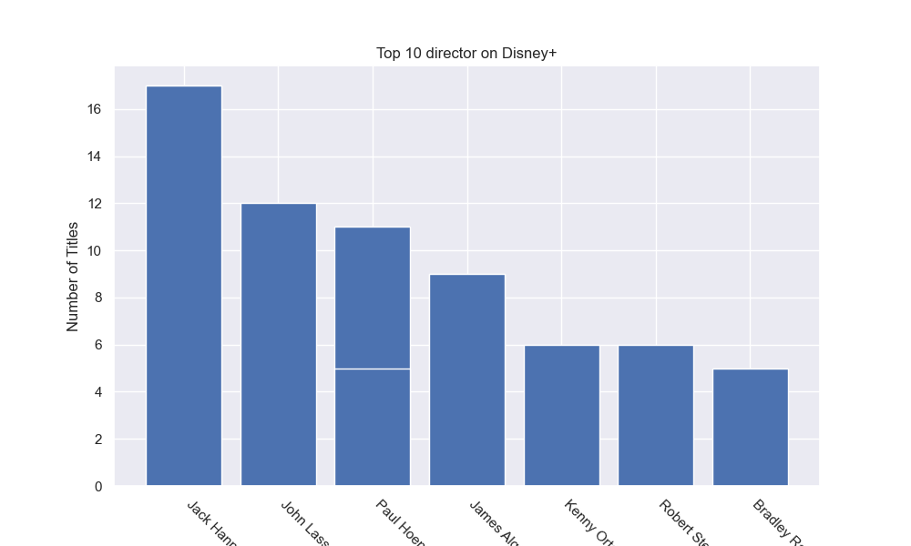

    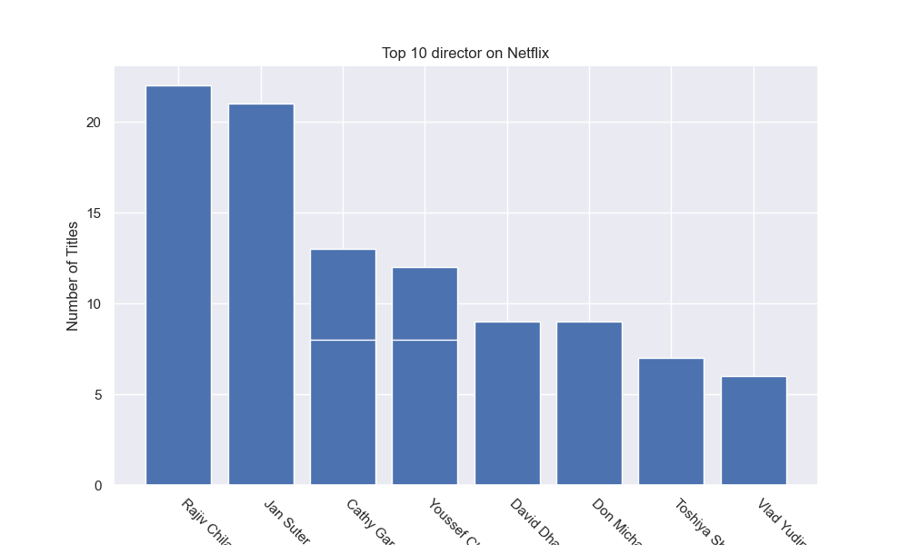
    

    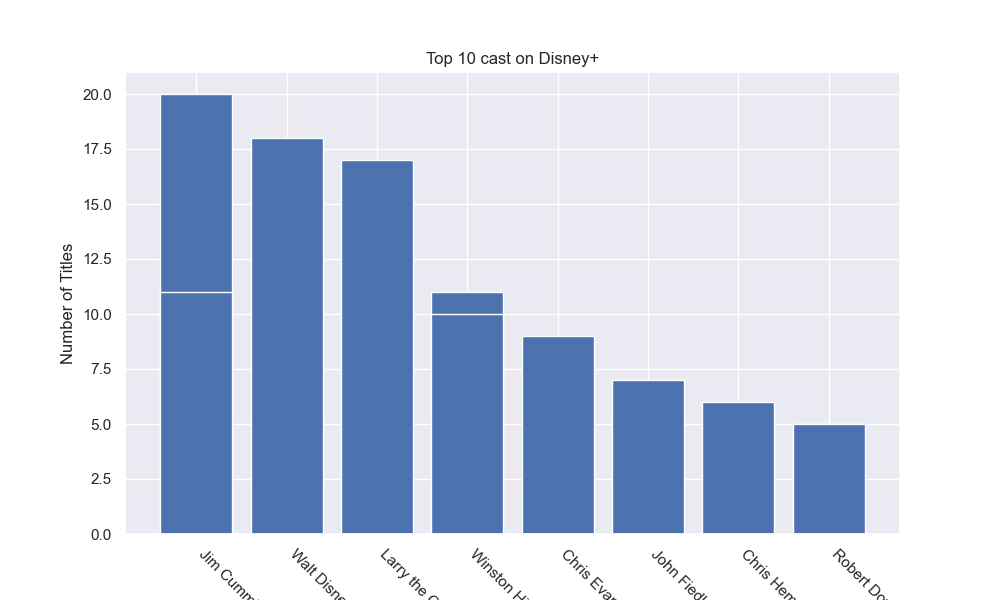
    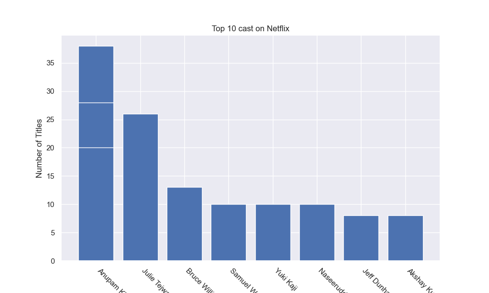

### **Question 2 (Alex): What is the feature distribution by year, and are there any trends for specific genres over the years.

So I started by creating a basic line graph to observe the general trend of how many features were released per year that made it onto a streaming service. My first observation was that the streaming services tended to favor newer content, either by popularity or exclusives (such as Netflix shows like Stranger Things). It makes sense that as the population has gone up since our oldest feature was released, that the number of features has increased exponentially, along with the population. The comparison of population and number of features vs time follow a very similar pattern.  More people watch newer content, so these streaming services tend to favor newer content then classic movies and TV shows. This is very reflective in the following plot.

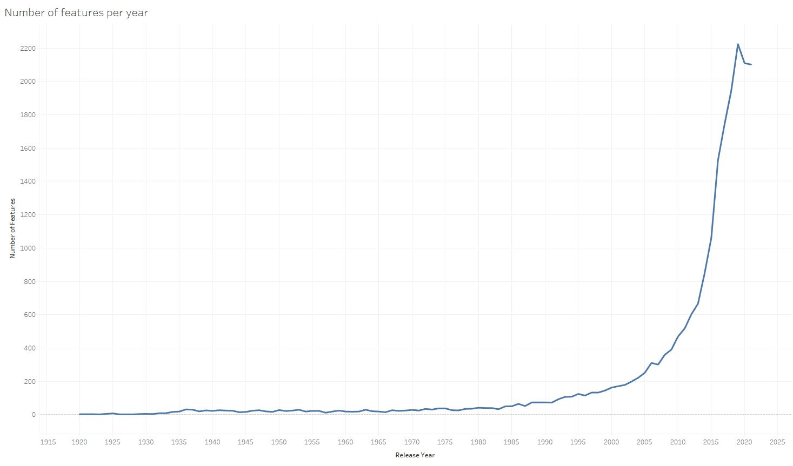

### Figure 1: Number of Total Features by Count by Release Year.

Next I wanted to analyze this further, by genre. My goal was to check for any trends regarding genre across this 100 year time period.  Though the number of features per genre can vary greatly, we can still compare relative trends between similar genres. PG-13 movies and TV-14 TV shows compare at 3162 features and 3111 features respectively. Though they share a similar number of features, PG-13 follows a much cleaner trend compared to TV-14. The amount of PG 13  trends upward much sooner than TV-14.

Generally, if we ignore feature count by genre, and just analyze the trends of each genre, we can see there aren't many outliers. No specific genre has a noticeable change between 1920 and 2000. Most trend upward exponentially from around 2000 onward. The last thing I noticed was that the TV prefix tended to follow the same pattern. Minus TV-Y7, every TV genre trended downward in 2021, the end of our dataset. A quick google search fills in why. “Historically, the fall television schedule was created to help auto advertisers promote their new car models.” Which makes sense, given that our dataset was last updated at the end of September 2021. The dataset has not been updated with fall shows, leaving the plunge shown in figure 3.

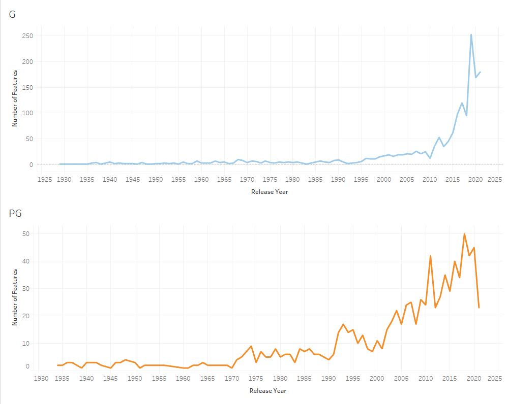
### Figure 2: Comparison of a High Feature Count vs a Low Feature Count Genre vs Time

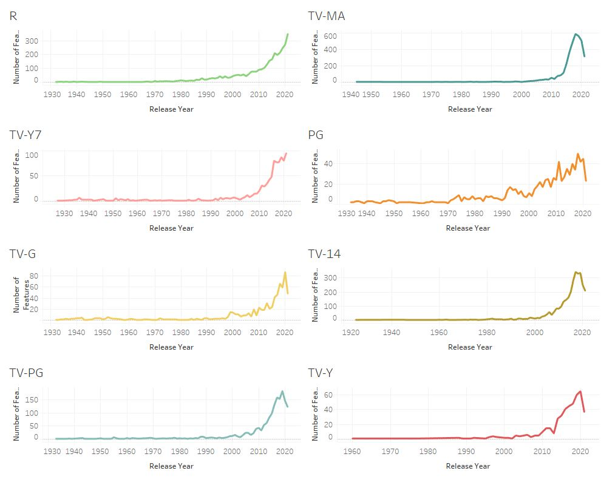
### Figure 3: Facet Plot of Count of Feature by Genre, compared to release date.
Figure 2 is showing the difference between a popular genre like G rated movies, vs a less prominent genre like PG. The top graph is more fluid, and less impacted by outlying years compared to the varying number of PG features we see in the bottom plot. Less features results in an increase in volatility. Figure 3 follows this as well, less data means more uncertainty in trends.

Overall, streaming services favor newer features versus older ones, while TV shows tend to be released later in the fall, compared to movies. There aren't any noticeable trends for specific genres over the years this dataset was recorded.

## **Conclusion**

For question 1, [The complete analysis and visualizations can be found here](./analysis/analysis_ethan.ipynb).
In this project, I analyzed various genres across different streaming platforms, as well as the directors and actors who participated in those genres.

My findings show that drama is a popular genre across all platforms except for Disney+, where family and animation are the most popular. Additionally, the least popular genres differ across platforms. I also found that each director and actor has their preferred genre, which could explain why they are more likely to appear in shows of specific genres. Interestingly, few directors or actors have participated in more than 20 shows, except on Amazon Prime.

Overall, this project provides insight into the dominant genres on various streaming platforms, as well as the preferences of directors and actors when it comes to genres. These findings could be useful for me and others interested in producing content for these platforms or for individuals interested in exploring specific genres.
